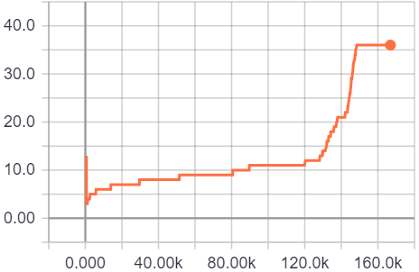
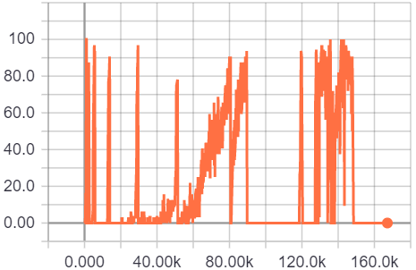

# Advanced Differentiable Neural Computer Applied to Symbolic Arithmetic

This repository is a clone of [Joerg Franke's original ADNC repo](https://github.com/JoergFranke/ADNC).
I have added several new symbolic arithmetic tasks, which provide integer operands to the network
as sequences of digits, and require the network to perform some simple arithmetic operation on them,
such as addition or subtraction. The network appears to successfully learn addition and subtraction
algorithms that can scale to non-negative integers of arbitrary length.

This is of course a very impractical and contrived way to perform arithmetic; after all,
these operations could be completed far more easily with a single line of code, no deep learning
involved. The purpose of this experiment is to investigate ADNC's ability to work with symbolic
information, using symbolic arithmetic as a toy example.

## Background

Most deep learning systems work with
sub-symbolic information, identifying vague indescribable patterns in images or board game strategies.
In contrast, more traditional AI techniques such as expert systems work with very explicit and clear
symbolic facts, with applications to problems such as inference and planning.
Deep learning has yet to show any great ability to work with symbolic information, which can be owed
in part to the small or non-existent memory capacity of most neural network architectures;
storing all the facts required for an expert system requires a large amount of structured memory.

DeepMind's [Differentiable Neural Computer](https://www.nature.com/articles/nature20101.epdf?author_access_token=ImTXBI8aWbYxYQ51Plys8NRgN0jAjWel9jnR3ZoTv0MggmpDmwljGswxVdeocYSurJ3hxupzWuRNeGvvXnoO8o4jTJcnAyhGuZzXJ1GEaD-Z7E6X_a9R-xqJ9TfJWBqz)
(DNC) is a promising step towards deep symbolic reasoning, as it possesses a large matrix of memory cells
which the network can use to store and manipulate a large number of distinct data elements at run time.
The original DNC paper demonstrates how this memory is used to solve symbolic reasoning problems
that are usually completely foreign to neural networks, such as graph algorithms.
The memory cells are used to store each edge in the graph as they are given to the network,
and the memory can then be further manipulated to process the data and produce an output.
ADNC is an enhanced version of DNC, with several optimizations that drastically improve training
speeds.

By experimenting with simple symbolic reasoning problems using deep learning, I hope to work towards
merging the advanced reasoning capabilities of traditional symbolic reasoning with the flexibility
and learning capabilities of sub-symbolic deep learning.

## Techniques Used

#### Curriculum Learning

In order to make the network learn algorithms that scale to input sequences of arbitrary length,
I initially gave the network inputs of 2-3 digits in length, increasing the length by one every time
95% accuracy was achieved on an input batch. Initially, increasing the sequence length causes the
accuracy to drop back to zero again, as the length-specific algorithm learned by the network has
to be modified to work with the new length, however over time the accuracy starts to remain stable
every time the length is increased, as the network finally learns an algorithm that generalises over
length. Starting with smaller inputs makes it easier for the network to grasp the essence of the
problem, and increasing the length forces it to generalise to arbitrary length inputs.

#### Transfer Learning

For the addition task, it is possible to train the network from scratch and have it work fine.
However, for the subtraction task I found that the network was not able to learn a generalized
algorithm when trained from scratch.  Instead, I had to first train it on the addition task,
then run the subtraction task with the weights initialized to those from the fully trained addition
network. This probably worked because it allowed the network to learn the basic mechanics of the
domain from the easier addition problem, before applying this knowledge to the harder subtraction
problem.

## Results

 The graphs below show a successful run of the subtraction task; the addition task produced
 similar graphs.
 
 #### Input Length
 
 
 
 We can see how the maximum input length increases gradually at first, however
 after about 120k steps it starts to rapidly increase as a generalized algorithm is learnt that
 achieves high accuracy instantly on every new input length. Eventually the input length suddenly
 plateaus, as the maximum capacity of the memory matrix is reached.
 
 #### Accuracy
 
 
 
 Up to around 90k steps we can see that every time the input length increases the accuracy suddenly
 drops to 0%, then gradually rises back towards 100% at which point the length increases again.
 The cycle occurs rapidly at first, however as the length increases the time required to train to
 each new length increases. At about 90k steps the accuracy drops to 0% and stays there for over 20k
 steps; this is probably because the maximum capacity of whatever length-specific memory system
 the network was using has been reached. At 120k steps the accuracy suddenly rises again and
 the input length rapidly increases, implying a length-generalized algorithm has suddenly been learned.